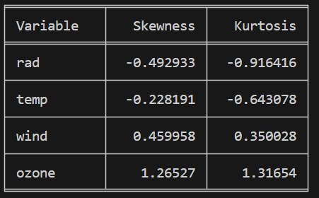
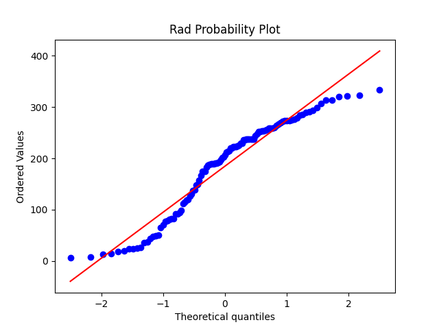
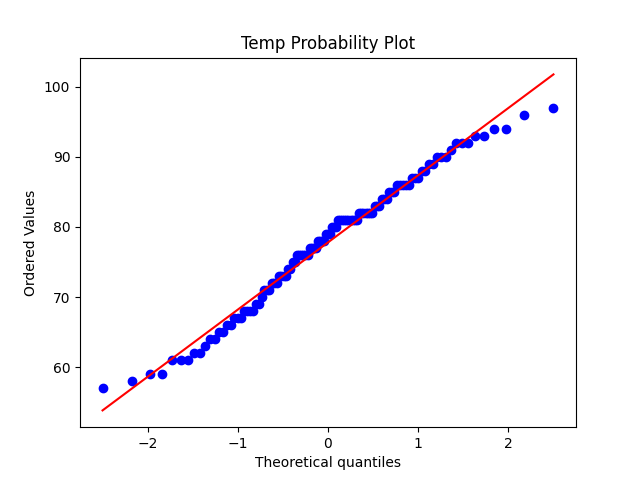
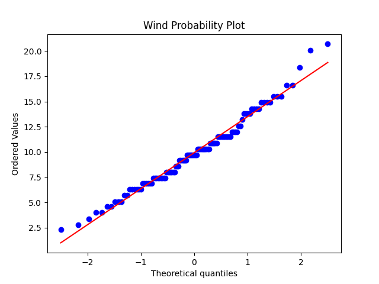
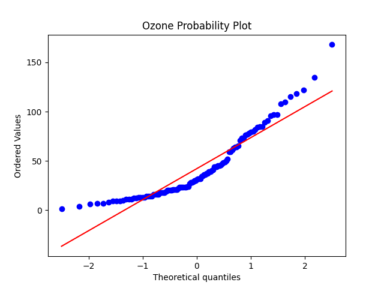
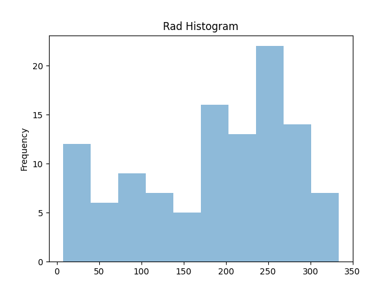
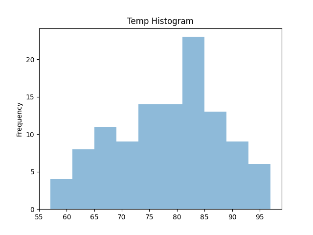
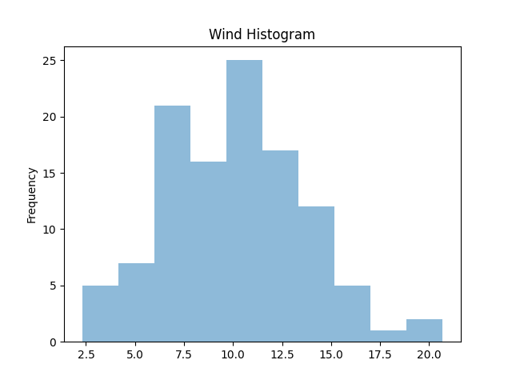
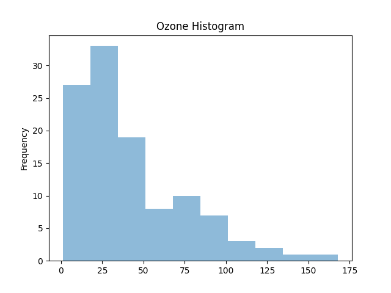

# Descriptive Statistics with Python
Submission for Natalie Parrent

## 1. Summarizing the Data

The following table summarizes the descriptive stats for the seven requested variables:

## 2. Plotting with Python
Next we asses the data for outliers and linearity. To do this I will be using scatter plots for each variable against pollution to asses linearity. A scatter plot is chosen to assess linearity because they provide a visual representation of the relationship between two variables. 

To asses if the data has outliers, I created boxplots for each variable. Boxplots are chosen because boxplots provide a clear visual representation of the distribution of the data, including the median, quartiles, and any outliers. Outliers are represented as individual points beyond the whiskers of the boxplot, making them easy to spot.

### Temp
The temperature data against pollution has a negative trend. It does not appear linear; it appears to have more of a curved relationship. 

The temperature boxplot shows there is only one outlier:

### Industry
The industry data displays a fairly linear relationship to pollution. The scatter plot exhibits a positive trend with some bunching towards the lower end of the x-axis and y-axis.

The boxplot for the industry variable depicts 4 outliers. 

### Population
It is a little hard to determine if population has a linear relationship as there is a lot of bunching around the lower ends of the axes. If the few points towards the upper end of the x-axis were removed, I don't know if a trend would be visible. Those few points make it appear as if there is a postive linear trend. The bunched points do still seem to have somewhat of an upward trend, but it is really hard to tell. 

The boxplot for population reveals three outliers.

### Wind
This plot is really hard to determine if there is any postitive or negative correlation. I would lean towards no correlation between wind and pollution. 

This boxplot for wind shows there are no outliers.

### Rain
When comparing rain to pollution this plot is also hard to determine if there is any correlation. This looks similar to the wind with pollution. Most of the points are bunched around the lower end of the y-axis with this sort of peak happening in the center. It like like it could possibly have a curved relationship, but again, it is really hard to tell. 

It looks like there are two outliers for the rain variable on the lower end. 

### Wet Days

When we compared wet days to pollutions there seems to be a postive curved trend.

It appears that the wet days variable has two outliers on the lower end and 1 outlier on the upper end just outside the end of the whisker. 

## 3. Assessing Normality
To asses normality, quantile-quantile plots are created for each of the four variables in the ozone_data. Then these are compared to the Shapiro-Wilk test for each variable. 

Here are the Shapiro-Wilk test results for each variable:

### Rad
At first glace, the rad plot looks fairly normal as most of the points are close to the line, however there is a clear s-shape where the points curve back over the line twice. When using the the Shapiro_Wilk test, the pvalue is 2.95 e-5 and is therefore very highly significant which confirms to us that this distribution is not considered normal. 

### Temp
The QQ plot for the temparture variable looks fairly normal with the tail ends pulling away from the normal line a bit. Upon review of the Shario-Wilk test results it appears that this distribution can be considered normal with a pvalue of .09, coming in just over .05. 

### Wind
This distrbution looks normal with most points landing really close to or on the line. The Shapario_Wilk test also shows a p-value over 0.05 at 0.11 demonstrating that this distribution is indeed normal. 

### Ozone
This distribution does not appear normal. It has a clear curve where is crosses the normal line twice and at the tail ends the points pull away from the line. The Shapiro-Wilk test also confirms that the variable ozone is non-normal as its pvalue is 2.84 e-8 and is therefore very highly significant. 

## 4. Skewness and Kurtosis
Next, skeness and kurtosis are calcuated and compared to the histograms of each variable fore the ozone data. 

Here is a table with the calcuations for Skewness and Kurtosis: 

### Rad
The rad variable is slightly skewed left with a skewness result of -0.49. For Kurtosis, the rad distribution is platykurtic, meaning it is flatter and has lighter tails compared to a normal distribution. The Kurtosis result was -0.92. When comparing to the histogram it seems to match as there the bars are taller on the right hand side. It also appears like the bars towards the edges are still fairly tall so the overall apperance of the historgram is more flat. 

### Temp
Again, this variable, temparture, is sligtly skewed left, although less so than rad,  with a result of -.23. The Kurtorsis is platykurtic with flatter and lighter tails but again not as much as rad. The Kurtosis result is -0.64

The histogram looks closer to a normal distribution with the tallest bars just slightly to the left. The tails are also closer to a normal distribution compared to the rad historgram which makes sense as the the Kurtosis results is closer to 0 comparatively. 

### Wind
The wind variable is skewed to the right with a result of 0.46. This is also visible on the histgram with the taller few bars in the middle falling off faster towards the right. The kurtoris is a postive result, 0.35, meaning that it is a little leptokurtic and is a little more peaked with heavier tails. The histogram also looks more peaked compared to the last two:

### Ozone
Finally, the ozone variable has a more pronounced right skew with much heavier concentration of data on the left side of the histogram. The skewness is 1.27 which is the largest of the group. This data is also much more leptokurtic at 1. 32 compared to the other variables and appears much more peaked in the histogram with a reall clear longer tail out to the right. 

